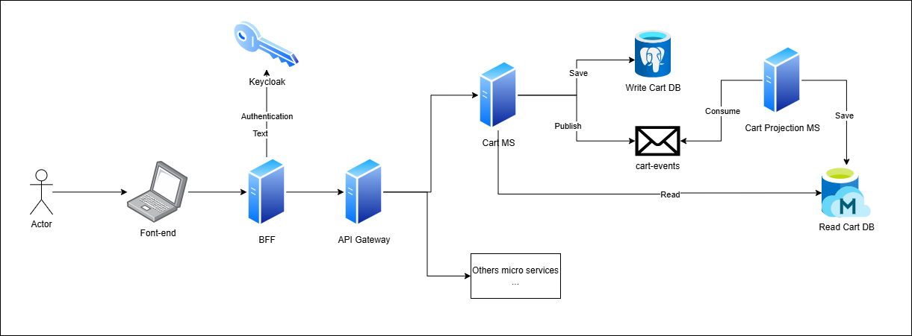
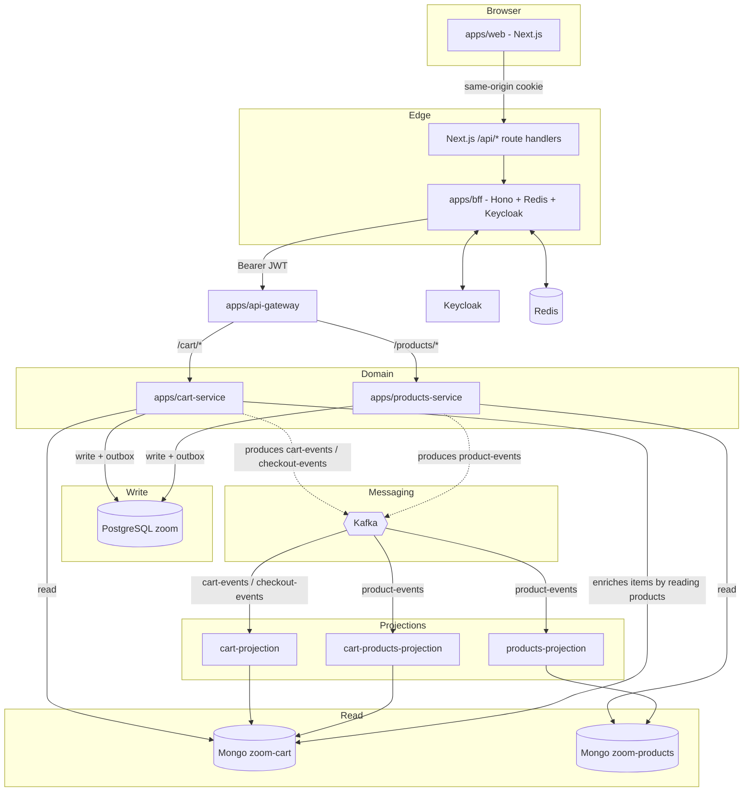

# Zoom Storm . Architecture Overview

Game store (current and retro titles) built as a TypeScript microservices
monorepo, following **Clean Architecture** per service and a **CQRS +
Event-Driven** pattern with asynchronous projections via Kafka.

---

## Stack

| Layer | Technology |
|-------|-----------|
| Frontend | Next.js (App Router) — storefront `apps/web`, port 3100 |
| Edge / Auth | BFF in Hono (`apps/bff`, port 8088) + Redis-backed session |
| Internal routing | API Gateway in Hono (`apps/api-gateway`, port 8087) |
| Domain services | `cart-service` (3000), `products-service` (3001) — Hono + Clean Architecture |
| Write database (write model) | PostgreSQL via Prisma |
| Read database (read model) | MongoDB |
| Messaging | Apache Kafka (KafkaJS) + Zookeeper |
| Projections (workers) | `cart-projection`, `products-projection`, `cart-products-projection` |
| Authentication | Keycloak (OIDC / JWT) |
| Cache / Session | Redis (ioredis) |
| Kafka observability | AKHQ |
| Tracing / metrics / logs | OpenTelemetry → Tempo / Prometheus / Loki, visualized in Grafana — see [observability.md](docs/observability.md) |

Local infra declared in [`docker-compose.yml`](docker-compose.yml). Environment
variables consolidated in [`.env.example`](.env.example).

---

## Components and responsibilities

| Service | Role | Writes to | Reads from | Produces to Kafka | Consumes from Kafka |
|---------|------|-----------|------------|--------------------|----------------------|
| `apps/web` | Next.js storefront (SSR + React Query) | — | via `/api/*` → BFF | — | — |
| `apps/bff` | OIDC authentication, `__Host-session` cookie, injects Bearer token | Redis (session) | Redis, Keycloak | — | — |
| `apps/api-gateway` | Reverse proxy for `/cart/*` and `/products/*` | — | — | — | — |
| `apps/cart-service` | Cart rules, coupons, shipping, checkout | Postgres `zoom` (write) | Mongo `zoom-cart` (read) | `cart-events`, `checkout-events` | — |
| `apps/products-service` | Product CRUD (admin) | Postgres `zoom` (write) | Mongo `zoom-products` (read) | `product-events` | — |
| `apps/cart-projection` | Materializes the cart read model | Mongo `zoom-cart`.`cart` | — | — | `cart-events`, `checkout-events` |
| `apps/products-projection` | Materializes the storefront catalog | Mongo `zoom-products`.`products` | — | — | `product-events` |
| `apps/cart-products-projection` | Product replica for the cart-service | Mongo `zoom-cart`.`products` | — | — | `product-events` |

---

## Overall diagram

> **Note on the cart-service read model:** `cart-service` reads product data
> from Mongo `zoom-cart`.`products`, which is populated by
> `cart-products-projection` from `product-events`. In other words, the
> catalog is replicated into the cart's database, avoiding a synchronous call
> to `products-service`.

---

## Architectural patterns

- **CQRS**: writes to Postgres (Prisma) and reads from MongoDB, synchronized
  by Kafka events + projection workers.
- **Outbox pattern**: an `OutboxEvent` table exists in both Prisma schemas and
  is written inside the same transaction as the write model change. A
  background `OutboxRelay` (`apps/cart-service/src/infrastructure/messaging/OutboxRelay.ts`
  and the `products-service` equivalent) polls unpublished rows, publishes
  them to Kafka, and marks `publishedAt`, giving at-least-once delivery
  instead of the earlier dual-write.
- **Clean Architecture**: each service separates `domain` / `application`
  (use cases, queries, mappers) / `infrastructure` (http, database, messaging).
- **BFF pattern**: the browser never talks directly to the gateway; the BFF
  stores the token in Redis and injects `Authorization: Bearer` server-side.

---

## Documented flows

| # | Flow | File | Criticality |
|---|------|------|-------------|
| 1 | Authentication (login/callback/session/proxy) | [auth-flow.md](docs/auth-flow.md) | High |
| 2 | Product registration/edit/removal (write + projections) | [product-registration-flow.md](docs/product-registration-flow.md) | High |
| 3 | Product listing and lookup (read model) | [product-listing-flow.md](docs/product-listing-flow.md) | High |
| 4 | Cart creation | [create-cart-flow.md](docs/create-cart-flow.md) | High |
| 5 | Managing cart items (add/update/remove) | [manage-cart-items-flow.md](docs/manage-cart-items-flow.md) | High |
| 6 | Discount coupon (apply/remove) | [coupon-flow.md](docs/coupon-flow.md) | Medium |
| 7 | Shipping calculation | [shipping-flow.md](docs/shipping-flow.md) | Medium |
| 8 | Checkout | [checkout-flow.md](docs/checkout-flow.md) | High |

---

## Kafka topics

| Topic | Producer | Consumers | Payload |
|-------|----------|-----------|---------|
| `cart-events` | cart-service (`KafkaEventPublisher` / `OutboxRelay`) | cart-projection | `{ name, occurredAt, payload: CartPrimitives }` |
| `checkout-events` | cart-service (checkout) | cart-projection (writes an order record) | `{ name, occurredAt, payload: CartPrimitives + shipping + total }` |
| `product-events` | products-service (`KafkaEventPublisher` / `OutboxRelay`) | products-projection, cart-products-projection | `{ name, occurredAt, payload: ProductPrimitives }` |

All cart events (`cart.created`, `cart.item_added`, `cart.item_removed`,
`cart.updated`) are routed to the same `cart-events` topic; `cart.checked_out`
goes to `checkout-events`.
