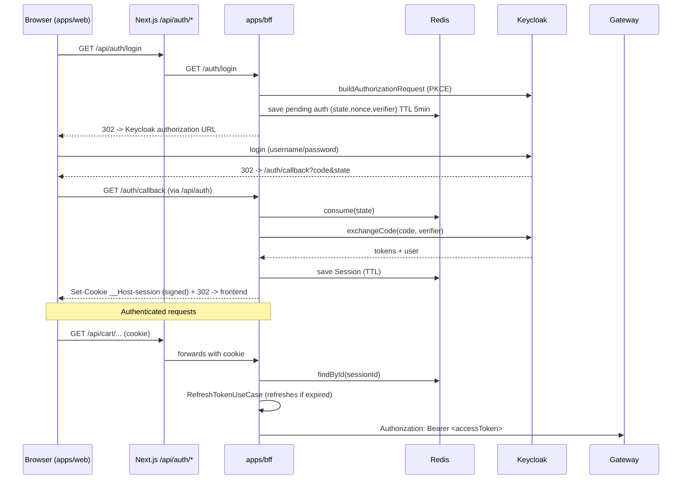

# Flow: Authentication and Session

## Business goal

Allow the user to log in via Keycloak (OIDC / Authorization Code + PKCE) and
maintain a secure session, so the browser never handles JWT tokens directly.
The BFF stores the tokens in Redis and injects the `Bearer` token in
server-to-server calls. Cart routes require a session; product routes accept
an optional session.

## Diagram



## Step by step

### 1. Frontend → BFF (same origin)
- Every HTTP request from `apps/web` goes through [`apps/web/src/lib/http.ts`](../apps/web/src/lib/http.ts),
  whose `baseURL` is always this Next.js server itself (`/api`), never the BFF
  directly — this keeps the `__Host-session` cookie same-origin and HttpOnly.
- The route handlers in `apps/web/src/app/api/auth/[[...path]]/route.ts`,
  `.../api/cart/...` and `.../api/products/...` use `createProxyRoute` to
  forward to the BFF.

### 2. Login — `GET /auth/login`
- Controller: [`AuthController.login`](../apps/bff/src/infrastructure/http/controllers/AuthController.ts#L19).
- Use case: [`LoginUseCase.execute`](../apps/bff/src/application/usecases/LoginUseCase.ts#L22)
  calls `keycloakAuthService.buildAuthorizationRequest(redirectUri)` (PKCE) and
  saves the pending authorization in Redis with a 5-minute TTL
  (`RedisPendingAuthorizationStore`).
- Redirects (302) to the Keycloak `authorizationUrl`.

### 3. Callback — `GET /auth/callback`
- Controller: [`AuthController.callback`](../apps/bff/src/infrastructure/http/controllers/AuthController.ts#L27).
- Use case: [`CallbackUseCase.execute`](../apps/bff/src/application/usecases/CallbackUseCase.ts#L25):
  1. `pendingAuthorizationStore.consume(state)` — if missing → `invalid_state` (400).
  2. `keycloakAuthService.exchangeCode({ currentUrl, state, nonce, codeVerifier })`.
  3. Creates `Session { id, user, tokens, createdAt }` and saves it in Redis with a TTL.
- Writes the signed `__Host-session` cookie (via `setSignedCookie`) and
  redirects to `env.frontend.url`.

### 4. Session middleware (protected routes)
- [`sessionAuthMiddleware`](../apps/bff/src/infrastructure/http/middlewares/sessionAuthMiddleware.ts#L15):
  1. Reads the signed cookie; missing → 401.
  2. `sessionRepository.findById(sessionId)`; missing → clears the cookie + 401.
  3. `RefreshTokenUseCase.execute({ session })` — refreshes the access token if
     expired; if `outcome === 'expired'` → clears the cookie + 401.
  4. Injects the refreshed session into `c.set('session', ...)`.
- `optionalSessionMiddleware` does the same but does not block when there is
  no session (used on `/products/*`).

### 5. Authenticated proxy BFF → Gateway
- [`ProxyController.forward`](../apps/bff/src/infrastructure/http/controllers/ProxyController.ts) →
  [`proxyToGateway`](../apps/bff/src/infrastructure/proxy/GatewayProxyClient.ts#L5):
  - Removes `host` and `cookie` from the headers.
  - If there is a session: `Authorization: Bearer <session.tokens.accessToken>`.
  - Removes `set-cookie` from the response before returning it to the browser.

### 6. Gateway → service → JWT validation
- [`api-gateway router`](../apps/api-gateway/src/infrastructure/http/router.ts): `all('/cart/*')`
  strips the `/cart` prefix and forwards to `env.services.cart`;
  `all('/products/*')` forwards to `env.services.products` (path preserved).
- In `cart-service`, [`requireAuth`](../apps/cart-service/src/infrastructure/http/middlewares/requireAuthMiddleware.ts)
  validates the JWT against Keycloak's JWKS (`jose.jwtVerify` with `issuer`),
  extracts `payload.sub`, and injects `c.set('userId', sub)`.
  - If `CART_SERVICE_SKIP_AUTH=true`, it injects `userId = 'local-dev-user'`
    without validation.

## Auth routes (BFF)

| Method | Route | Middleware | Description |
|--------|-------|-----------|--------------|
| GET | `/auth/login` | — | Starts OIDC, redirects to Keycloak |
| GET | `/auth/callback` | — | Exchanges code for tokens, creates session |
| POST | `/auth/logout` | requireSession | Ends the session (optionally global in Keycloak) |
| GET | `/auth/me` | requireSession | Returns the session `user` |

## Payloads

**Session (Redis)** — `apps/bff/src/domain/entities/Session.ts`:
```jsonc
{
  "id": "uuid",
  "user": { /* Keycloak user claims */ },
  "tokens": { "accessToken": "...", "refreshToken": "...", /* ... */ },
  "createdAt": 1234567890
}
```

**Header injected at the gateway:** `Authorization: Bearer <accessToken>`.

## Error handling and edge cases

- Missing `state` on the callback → 400 `Missing state`.
- Expired/already-consumed pending authorization → 400 `Invalid or expired authorization state`.
- Missing session or expired refresh → cookie removed + 401.
- `__Host-session` cookie: the `__Host-` prefix requires `Secure` + path `/` +
  no domain (requires HTTPS in production — verify local config).
- Invalid token at the service → 401 `Invalid or expired token`; no `sub` → 401.

## External dependencies

- **Keycloak** (`zoom-storm` realm) — issuer and JWKS configured via
  `KEYCLOAK_ISSUER_URL` / `KEYCLOAK_JWKS_URI`.
- **Redis** — stores sessions and pending authorizations.
