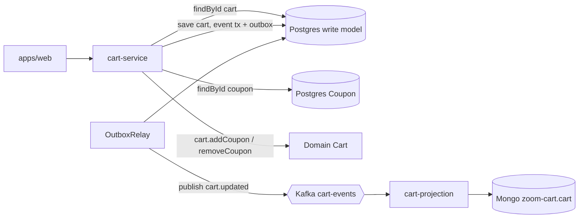

# Flow: Discount Coupon (Apply / Remove)

## Business goal

Apply and remove percentage coupons on a cart. Coupons have a validity
window (`start`/`end`) and a percentage. The discount is recalculated over
the subtotal and the read model is updated via a `cart.updated` event.

## Routes

| Method | Route | Use case |
|--------|-------|----------|
| POST | `/carts/:cartId/coupons` | `ApplyCouponUseCase` |
| DELETE | `/carts/:cartId/coupons/:couponId` | `RemoveCouponUseCase` |

Controller: [`CartCouponController`](../apps/cart-service/src/infrastructure/http/controllers/CartCouponController.ts).
Both require `requireAuth`.

## Diagram



## Step by step

### Apply coupon — `ApplyCouponUseCase`
[`ApplyCouponUseCase.execute`](../apps/cart-service/src/application/usecases/ApplyCouponUseCase.ts):
1. `Promise.all` → `cartRepository.findById` and `couponRepository.findById` (Postgres).
2. Missing cart / belonging to another user → `ERROR "Cart not found"`.
3. Missing coupon → `ERROR "Coupon not found"`.
4. `!coupon.isValid()` → `ERROR "Coupon \"<name>\" is not valid"`.
5. `cart.addCoupon(coupon)` — a no-op if the coupon is already applied (see
   domain rules below).
6. Builds `DomainEvent(CART_UPDATED, CartMapper.toPrimitives(cart), now)` and
   calls `cartRepository.save(cart, event)`, writing the outbox row in the
   same transaction.

### Remove coupon — `RemoveCouponUseCase`
[`RemoveCouponUseCase.execute`](../apps/cart-service/src/application/usecases/RemoveCouponUseCase.ts):
1. Looks up the cart + validates ownership.
2. Is the coupon present on the cart? If not → `ERROR "Coupon not found in cart"`.
3. `cart.removeCoupon(couponId)` → builds `CART_UPDATED` and calls
   `save(cart, event)`.

### Coupon domain rules
[`CouponPercentByTime`](../apps/cart-service/src/domain/entities/coupon/Coupon.ts):
- `isValid()` → `today >= start && today <= end`.
- `getDiscount(total)` → `total * percent` if valid, otherwise `0`.
- ⚠️ `percent` is treated as a **fraction** (e.g., `0.1` = 10%). Confirm the
  convention used when registering coupons in Postgres (the `Coupon.percent`
  column is a `Float`).
- The discount is applied over `cart.calcSubtotal()` in
  [`CartMapper`](../apps/cart-service/src/application/mappers/CartMapper.ts)
  and `Cart.calcTotalDiscount`; `calcTotal` does `Math.max(0, subtotal - discount)`.
- [`Cart.addCoupon`](../apps/cart-service/src/domain/entities/cart/Cart.ts)
  checks whether a coupon with the same `id` is already applied and, if so,
  ignores the re-application — this prevents the same coupon from being
  applied twice and stacking its discount.

> **Note on validity:** when rebuilding the coupon in
> [`PrismaCartRepository.findById`](../apps/cart-service/src/infrastructure/database/prisma/repositories/PrismaCartRepository.ts),
> `today` is `new Date()` (the moment of the read). When creating via
> `CreateCartUseCase`/`ApplyCouponUseCase`, the coupon comes from the
> `CouponRepository`. Verify the rebuilt instance uses `today` consistently
> (requires validation).

## Payloads

**`POST /carts/:cartId/coupons`:**
```jsonc
{ "couponId": "coupon-uuid" }
```
**Response:** `200 { "status": "SUCCESS", "cart": CartPrimitives }` (with
recalculated `coupons[]` and `totalDiscount`) or
`422 { "status": "ERROR", "message": "..." }`.

**Event (`cart-events`):** `{ name: "cart.updated", occurredAt, payload: CartPrimitives }`.

## Error handling and edge cases

- Expired / out-of-window coupon → 422.
- Applying the same coupon twice is now a no-op at the domain level (see
  `Cart.addCoupon` above), so the discount is not double-counted. The
  `CartCoupon` table's composite PK `[cartId, couponId]` also prevents
  duplicate rows at the database layer.

## External dependencies

- Postgres `zoom` (`Coupon`, `CartCoupon`, cart write model), Kafka `cart-events`,
  Mongo `zoom-cart` (read model).
