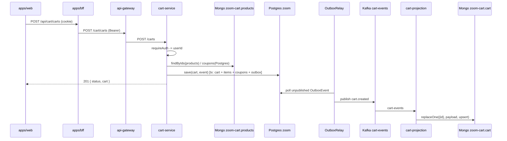

# Flow: Cart Creation

## Business goal

Create a cart for the authenticated user, optionally already with items and
coupons. The cart is persisted in PostgreSQL (write model) and a
`cart.created` event is published through the outbox to materialize the read
model in MongoDB.

## Diagram



## Step by step

### 1. Frontend
- The [`useCart`](../apps/web/src/hooks/use-cart.ts) hook manages the
  lifecycle. `ensureCart` creates the cart on demand
  (`cartService.create({})`) on first interaction, requiring a logged-in user
  (`"É necessário entrar para montar um carrinho"`).
- The `cartId` is stored in `localStorage` via
  [`useCartId`](../apps/web/src/hooks/use-cart-id.ts) (using
  `useSyncExternalStore` to keep every instance in sync). **There is no
  "cart by user" lookup** on the backend — the `cartId` is the frontend's
  only handle.

### 2. Entry into cart-service — `POST /carts`
- [`router`](../apps/cart-service/src/infrastructure/http/router.ts#L68): `requireAuth` +
  `CartController.create`.
- [`CartController.create`](../apps/cart-service/src/infrastructure/http/controllers/CartController.ts#L27):
  validates with `CreateCartSchema` (Zod) and injects `userId = c.get('userId')`.

### 3. Use case
- [`CreateCartUseCase.execute`](../apps/cart-service/src/application/usecases/CreateCartUseCase.ts):
  1. `Promise.all` → `productRepository.findByIds(...)` (Mongo `zoom-cart`.`products`)
     and `couponRepository.findByIds(...)` (Postgres).
  2. If any coupon/product is not found → `ERROR` (`Coupon not found` / `Product not found`).
  3. Creates `new Cart(IdType.create(userId), IdType.create())` — **the first
     arg is the `userId`, the second is the cart's new id** (generated UUID).
  4. For each requested product, `cart.addItem(new CartItem(IdType.create(), product, quantity))`.
  5. For each coupon, validates `coupon.isValid()`; invalid → `ERROR`; otherwise `cart.addCoupon`.
  6. Builds `DomainEvent(CART_CREATED, CartMapper.toPrimitives(cart), now)`.
  7. `cartRepository.save(cart, event)` — the outbox write and the domain
     write happen in the same transaction.

### 4. Persistence (write model + outbox)
- [`PrismaCartRepository.save`](../apps/cart-service/src/infrastructure/database/prisma/repositories/PrismaCartRepository.ts),
  in a transaction:
  - Creates the `Cart` (or applies optimistic locking on update — see the
    items flow).
  - `deleteMany` on orphaned items/coupons, `upsert` on current items/coupons.
  - Writes the `OutboxEvent` row for the `cart.created` event.

### 5. Delivery + projection
- [`OutboxRelay`](../apps/cart-service/src/infrastructure/messaging/OutboxRelay.ts)
  picks up the pending `OutboxEvent` and publishes it via `KafkaEventPublisher`
  to the `cart-events` topic, then marks `publishedAt`.
- [`CartSavedHandler`](../apps/cart-projection/src/handlers/cart-saved.handler.ts) →
  [`CartRepository.save`](../apps/cart-projection/src/repository/cart.repository.ts):
  `replaceOne({ id: payload.id }, payload, { upsert: true })` on the `cart`
  collection in Mongo `zoom-cart`.

### 6. Subsequent reads
- `GET /carts/:cartId` → [`CartController.getById`](../apps/cart-service/src/infrastructure/http/controllers/CartController.ts#L17) →
  `CartQuery` → [`MongoCartQueryRepository.findById`](../apps/cart-service/src/infrastructure/database/mongodb/repositories/MongoCartQueryRepository.ts)
  reads the `cart` collection (read model). Not found → 404.

## Payloads

**Request (`POST /carts`)** — `CreateCartSchema`:
```jsonc
{ "products": [ { "id": "uuid", "quantity": 2 } ], "coupons": ["couponId"] }
```
> `userId` is NOT part of the body — it is extracted from the JWT.

**Kafka event (`cart-events`, `cart.created`) / read-model document** —
`CartMapper.toPrimitives`:
```jsonc
{
  "id": "cartId", "userId": "userId",
  "items": [ { "id": "itemId", "quantity": 2,
    "product": { "id": "...", "name": "...", "price": 199.9, "stock": 10,
                 "weight": 0.2, "transportHeight": 2, "transportWidth": 15, "transportLength": 13 },
    "subtotal": 399.8 } ],
  "coupons": [ { "id": "...", "name": "...", "discount": 40.0 } ],
  "subtotal": 399.8, "totalDiscount": 40.0, "total": 359.8
}
```

## Error handling and edge cases

- Missing product/coupon → 422 `Product not found` / `Coupon not found`.
- Coupon outside its validity window → 422 `Coupon "<name>" is not valid`.
- Unexpected error → `handleUnexpectedError` (status `ERROR`).
- **Eventual consistency**: a `GET` right after the `POST` may not find the
  cart in the read model yet if the relay/projection hasn't processed the
  event. As a mitigation, the frontend uses the `cart` returned in the
  `POST` body (`setCart` in `onSuccess`) and caches it in React Query.
- The item's `subtotal` uses `item.getPrice()` (unit price × quantity — verify
  the "subtotal" vs. "unit price" semantics if this surprises you).

## External dependencies

- Mongo `zoom-cart` (`products` to enrich items, `cart` for reads),
  Postgres `zoom` (coupons + cart write model), Kafka `cart-events`.
