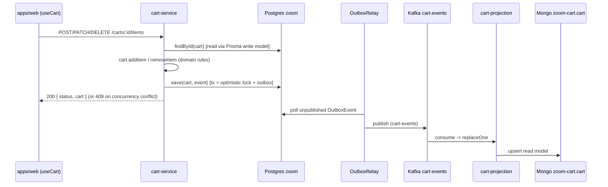

# Flow: Managing Cart Items (Add / Update / Remove)

## Business goal

Add products to the cart, change an existing item's quantity, and remove
items. Each operation recalculates subtotals/total and synchronizes the read
model through a Kafka event delivered via the outbox relay.

## Routes

| Method | Route | Use case |
|--------|-------|----------|
| POST | `/carts/:cartId/items` | `AddItemToCartUseCase` |
| PATCH | `/carts/:cartId/items/:itemId` | `UpdateItemQuantityUseCase` |
| DELETE | `/carts/:cartId/items/:itemId` | `RemoveItemFromCartUseCase` |

All require `requireAuth` ([router](../apps/cart-service/src/infrastructure/http/router.ts#L70)).
Controller: [`CartItemController`](../apps/cart-service/src/infrastructure/http/controllers/CartItemController.ts).

## Diagram



## Step by step

### Add item — `AddItemToCartUseCase`
[`AddItemToCartUseCase.execute`](../apps/cart-service/src/application/usecases/AddItemToCartUseCase.ts):
1. `Promise.all` → looks up products (`ProductRepository.findByIds`, Mongo `zoom-cart`.`products`)
   and the cart (`CartRepository.findById`, Prisma write model).
2. Missing cart **or** `cart.userId !== input.userId` → `ERROR "Cart not found"`
   (same message for both — ownership protection).
3. `products.length !== input.products.length` → `ERROR "Product not found"`.
4. For each product with a `quantity`, `cart.addItem(new CartItem(IdType.create(), product, quantity))`.
5. Builds `DomainEvent(CART_ITEM_ADDED, ...)` and calls `save(cart, event)`.

**Duplicate-item merge** — [`Cart.addItem`](../apps/cart-service/src/domain/entities/cart/Cart.ts#L15):
if an item with the same `product.id` already exists, its quantity is summed
(a new `CartItem` is created with the combined `quantity`) instead of adding a
duplicate row.

### Update quantity — `UpdateItemQuantityUseCase`
[`UpdateItemQuantityUseCase.execute`](../apps/cart-service/src/application/usecases/UpdateItemQuantityUseCase.ts):
1. Looks up the cart + validates ownership.
2. Finds the item by `itemId`; missing → `ERROR "Item not found in cart"`.
3. Re-fetches the product (`productRepository.findById`); missing → `ERROR "Product not found"`.
4. `cart.removeItem(itemId)` followed by `cart.addItem(new CartItem(itemId, product, quantity))`
   (replaces it with the new quantity).
5. Builds the `CART_UPDATED` event and calls `save(cart, event)`.

### Remove item — `RemoveItemFromCartUseCase`
[`RemoveItemFromCartUseCase.execute`](../apps/cart-service/src/application/usecases/RemoveItemFromCartUseCase.ts):
1. Looks up the cart + validates ownership.
2. Checks the item exists; missing → `ERROR "Item not found in cart"`.
3. `cart.removeItem(itemId)`.
4. Builds `CART_ITEM_REMOVED` and calls `save(cart, event)`, writing the
   outbox row so the `OutboxRelay` delivers it to `cart-events` and the read
   model stays in sync with the removal.

## Persistence and concurrency (optimistic locking)

[`PrismaCartRepository.save`](../apps/cart-service/src/infrastructure/database/prisma/repositories/PrismaCartRepository.ts),
in a Prisma transaction:
1. `findUnique` on the cart by id (only `version`).
2. If it doesn't exist → `create`. If it exists → `updateMany where { id, version } data { version: increment }`;
   if `count === 0` → throws `ConcurrencyConflictError` (two concurrent writes
   on the same version).
3. `deleteMany` on items/coupons no longer in the aggregate, and `upsert` on
   the current ones.
4. Writes one `OutboxEvent` row per event passed to `save` (a single event or
   an array of events) in the same transaction.

> Note: `findById` rebuilds the `Cart` from the write model (Prisma) with the
> current `version` — required for the optimistic lock to work.

## Payloads

**`POST /carts/:cartId/items`** (`AddItemsSchema`):
```jsonc
{ "products": [ { "id": "uuid", "quantity": 1 } ] }
```
**`PATCH /carts/:cartId/items/:itemId`** (`UpdateQuantitySchema`):
```jsonc
{ "quantity": 3 }
```
**Response (all):** `200 { "status": "SUCCESS", "cart": CartPrimitives }`,
`409 { "status": "ERROR", "message": "Cart was modified concurrently, please retry.", "code": "CONCURRENCY_CONFLICT" }`,
or `422 { "status": "ERROR", "message": "..." }`.

**Event** (`cart-events`): `{ name: "cart.item_added" | "cart.updated" | "cart.item_removed", occurredAt, payload: CartPrimitives }`.

## Error handling and edge cases

- Ownership: another user's cart → `Cart not found` (does not leak existence).
- `CartItem` validates a positive integer `quantity` in its constructor
  (throws → caught by `handleUnexpectedError`).
- `ConcurrencyConflictError` on a concurrent write maps to HTTP **409** via
  the `code: 'CONCURRENCY_CONFLICT'` field on the error output and the
  `httpStatus()` helper used by the controllers.
- Frontend ([`useCart`](../apps/web/src/hooks/use-cart.ts)) treats
  `"Cart not found"` as a stale cart: it clears `localStorage` and re-creates
  the cart (in `addItem`), and treats `"Product not found"` as a friendly,
  user-facing message instead of a raw error.

## External dependencies

- Postgres `zoom` (write model + optimistic lock + outbox), Mongo `zoom-cart`
  (`products` to enrich, `cart` for reads), Kafka `cart-events`.
