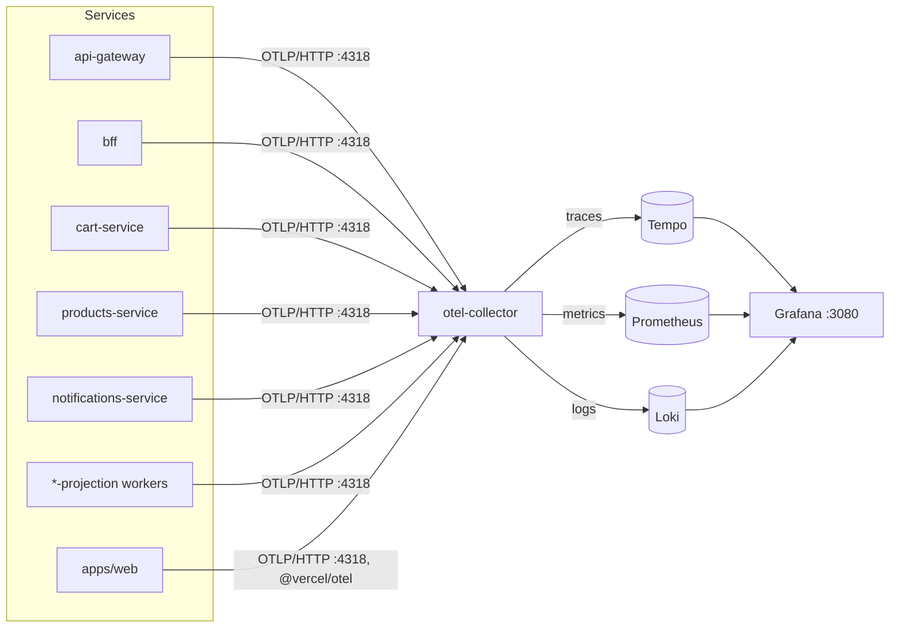

# Observability

## Goal

Every backend service (all `apps/*-service`, `*-projection` workers, `api-gateway`
and `bff`) exports traces, metrics and logs via OpenTelemetry to a local
collector, which fans them out to Tempo (traces), Prometheus (metrics) and
Loki (logs) — all queryable from a single Grafana instance. `apps/web`
exports traces separately via `@vercel/otel`.

## Diagram



## How services export telemetry

Every backend `dev:*` script in the root [`package.json`](../package.json)
preloads [`otel/tracing.ts`](../otel/tracing.ts) via `tsx watch -r`:

```
tsx watch --inspect=... --tsconfig tsconfig.json -r ./otel/tracing.ts <entry>
```

This runs *before* the service's own entry file, so `http`, `pg`,
`mongodb`, `kafkajs` and `ioredis` are already instrumented
(`getNodeAutoInstrumentations`) by the time application code requires them.
Prisma is instrumented separately via `PrismaInstrumentation`.

- **Service name**: taken from the `OTEL_SERVICE_NAME` env var set per
  script (e.g. `OTEL_SERVICE_NAME=cart-service`).
- **Logs**: there's no logging library in this repo — `otel/tracing.ts`
  monkey-patches `console.log/info/warn/error/debug` to also emit an OTel
  `LogRecord`, stamped with the active span's `trace_id`/`span_id` so Loki
  log lines can be linked back to a Tempo trace.
- **Trace propagation across proxies**: `instrumentation-undici`'s
  automatic `traceparent` header injection was unreliable across the
  `bff → api-gateway → service` hops, so it's disabled
  (`'@opentelemetry/instrumentation-undici': { enabled: false }`) and the
  proxy clients ([`GatewayProxyClient`](../apps/bff/src/infrastructure/proxy/GatewayProxyClient.ts),
  [`apps/api-gateway`'s proxy](../apps/api-gateway/src/infrastructure/http/proxy.ts))
  create their own CLIENT span and inject the header manually instead.
- **Shutdown flush is best-effort**: each service registers its own
  SIGINT/SIGTERM handler that may call `process.exit()` before the OTLP
  exporters finish flushing (see the comment in `otel/tracing.ts`). A short
  10s metric export interval mitigates most loss; the last few
  spans/logs/metrics before a shutdown can still be dropped.

`apps/web` uses [`@vercel/otel`](../apps/web/src/instrumentation.ts) instead,
since it runs inside Next.js's own request lifecycle rather than a
long-lived Node process.

## Collector pipeline

[`observability/otel-collector-config.yaml`](../observability/otel-collector-config.yaml)
receives OTLP (gRPC `:4317` / HTTP `:4318`), batches everything, and routes
each signal to its backend:

| Signal  | Exporter         | Backend      |
|---------|------------------|--------------|
| Traces  | `otlp/tempo`     | Tempo `:4317` |
| Metrics | `prometheus`     | scraped by Prometheus from `:8889` |
| Logs    | `otlphttp/loki`  | Loki `/otlp` |

A `debug` exporter is also wired on all three pipelines, so raw OTLP
payloads show up in the `zoom-otel-collector` container logs when
troubleshooting.

## Local infra & ports

Declared in [`docker-compose.yml`](../docker-compose.yml), configs under
[`observability/`](../observability):

| Service | Port(s) | Config |
|---|---|---|
| otel-collector | `4317` (gRPC), `4318` (HTTP), `8889` (Prometheus scrape) | [`otel-collector-config.yaml`](../observability/otel-collector-config.yaml) |
| Tempo | `3200` | [`tempo.yaml`](../observability/tempo.yaml) |
| Loki | `3060` → container `3100` | [`loki-config.yaml`](../observability/loki-config.yaml) |
| Prometheus | `9090` | [`prometheus.yml`](../observability/prometheus.yml) |
| Grafana | `3080` → container `3000` | [`grafana/provisioning`](../observability/grafana/provisioning) (datasources pre-provisioned for Tempo/Loki/Prometheus) |

`OTEL_EXPORTER_OTLP_ENDPOINT` (default `http://localhost:4318`) is set in
[`.env.example`](../.env.example) for every service that needs it.

## Using it

1. `./up.sh` (or `docker compose up -d`) brings up the collector + Tempo +
   Loki + Prometheus + Grafana alongside the rest of the infra.
2. `yarn dev` starts every service with tracing preloaded.
3. Open Grafana at `http://localhost:3080` — Tempo/Loki/Prometheus
   datasources are already provisioned; search traces by service name
   (e.g. `cart-service`) or jump from a log line to its trace via the
   Loki → Tempo derived field.
4. Kafka itself is inspected separately through AKHQ (see the root
   [`README.md`](../README.md)), not through this stack.

## Known gaps

- No alerting rules are configured in Prometheus/Grafana — this stack is
  for local debugging only.
- `apps/web`'s client-side telemetry (browser spans) is not covered here,
  only its server-side Next.js instrumentation via `@vercel/otel`.
</content>
