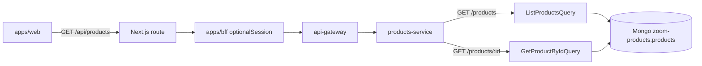

# Flow: Product Listing and Lookup (Read Model)

## Business goal

Display the catalog on the storefront (`apps/web`) and the product detail
page. This is the CQRS **read** path: both the list and the detail come from
the read model (MongoDB), populated asynchronously by `products-projection`.

## Diagram



## Step by step

### 1. Frontend
- Hooks [`useProducts` / `useProduct`](../apps/web/src/hooks/use-products.ts)
  use React Query over `productService.list` / `productService.getById`.
- Calls go through `apps/web/src/services/product-service.ts` → `http` →
  `/api/products/*` (route handler `createProxyRoute("/products")`).
- Pages: catalog at [`apps/web/src/app/page.tsx`](../apps/web/src/app/page.tsx),
  detail at [`apps/web/src/app/products/[id]/page.tsx`](../apps/web/src/app/products/[id]/page.tsx).

### 2. BFF → Gateway
- In the BFF, `/products/*` uses `optionalSession` — works whether logged in
  or anonymous ([`bff router`](../apps/bff/src/infrastructure/http/router.ts#L72)).
- The gateway forwards `/products/*` preserving the path to `products-service`.

### 3. products-service

**List — `GET /products`**
- [`ProductController.list`](../apps/products-service/src/infrastructure/http/controllers/ProductController.ts#L29) →
  [`ListProductsQuery.execute`](../apps/products-service/src/application/queries/ListProductsQuery.ts):
  calls `productQueryRepository.findAll()`.
- [`MongoProductQueryRepository.findAll`](../apps/products-service/src/infrastructure/database/mongodb/repositories/MongoProductQueryRepository.ts)
  reads the `products` collection from Mongo `zoom-products` (**read model**),
  stripping `_id`.

**Detail — `GET /products/:id`**
- [`ProductController.getById`](../apps/products-service/src/infrastructure/http/controllers/ProductController.ts#L36) →
  [`GetProductByIdQuery.execute({ id })`](../apps/products-service/src/application/queries/GetProductByIdQuery.ts).
- `GetProductByIdQuery` depends on the same
  [`ProductQueryRepository`](../apps/products-service/src/domain/repositories/ProductQueryRepository.ts)
  (Mongo read model) as the list, via its `findById` method — both routes now
  read from the same source, keeping list and detail consistent with each
  other.

## Payloads

**Response `GET /products`:**
```jsonc
{ "status": "SUCCESS", "products": [ { "id": "...", "name": "...", "price": 199.9, "stock": 10, /* ... */ } ] }
```

**Response `GET /products/:id`:** `200` `{ "status": "SUCCESS", "product": {...} }` or `404`.

## Error handling and edge cases

- The list always returns `SUCCESS` (200), even when empty.
- Detail: not found → 404.
- **Projection latency**: a newly created product only appears in the list
  (and now the detail too) once `products-projection` has consumed the
  event — genuine, uniform eventual consistency instead of the previous
  split-source inconsistency between list and detail.
- Deleted products are removed from the storefront read model by
  `products-projection` (see [product-registration-flow.md](./product-registration-flow.md)).

## External dependencies

- MongoDB (`zoom-products`), Kafka (indirectly, via the projection).
