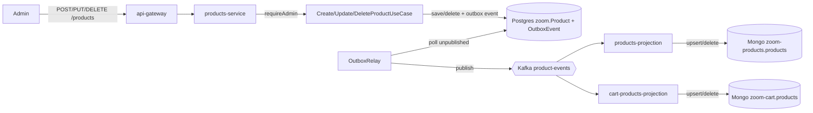

# Flow: Product Registration / Edit / Removal

## Business goal

Allow an **admin** to manage the catalog (create, update, remove products).
The write goes to PostgreSQL through the outbox table, and a relay publishes
the corresponding event to Kafka so the read models (storefront catalog and
the cart-service replica) are materialized asynchronously.

## Diagram



## Step by step

### 1. HTTP entry and authorization
- Routes in [`products-service router`](../apps/products-service/src/infrastructure/http/router.ts#L62):
  - `POST /products` → `requireAdmin` → `ProductController.create`
  - `PUT /products/:id` → `requireAdmin` → `ProductController.update`
  - `DELETE /products/:id` → `requireAdmin` → `ProductController.delete`
- [`requireAdmin`](../apps/products-service/src/infrastructure/http/middlewares/requireAdminMiddleware.ts)
  validates the admin JWT/role (bypass via `PRODUCTS_SERVICE_SKIP_AUTH=true`).
- Payload validation with Zod in `schemas/product.schemas.ts`
  (`CreateProductSchema`, `UpdateProductSchema`); on error → `validationError`.

### 2. Use case (write)
- [`CreateProductUseCase.execute`](../apps/products-service/src/application/usecases/CreateProductUseCase.ts):
  builds a `Product` with `IdType.create()` (new UUID), builds the
  `PRODUCT_CREATED` `DomainEvent`, and calls
  `productRepository.save(product, event)`.
- [`UpdateProductUseCase`](../apps/products-service/src/application/usecases/UpdateProductUseCase.ts) and
  [`DeleteProductUseCase`](../apps/products-service/src/application/usecases/DeleteProductUseCase.ts)
  follow the same pattern (`save(updated, event)` / `delete(id, event)`),
  always passing the domain event through to the repository.

### 3. Write-model persistence + outbox
- [`PrismaProductRepository.save`/`delete`](../apps/products-service/src/infrastructure/database/prisma/repositories/PrismaProductRepository.ts)
  upserts/deletes the product **inside a transaction** and writes the matching
  `OutboxEvent` row in the same transaction, guaranteeing the write and the
  outbox entry are atomic.

### 4. Event delivery via the outbox relay
- [`OutboxRelay`](../apps/products-service/src/infrastructure/messaging/OutboxRelay.ts)
  runs on an interval, polling `OutboxEvent where publishedAt is null`,
  publishing each one through `KafkaEventPublisher`, and marking
  `publishedAt` once delivered.
- [`KafkaEventPublisher`](../apps/products-service/src/infrastructure/messaging/KafkaEventPublisher.ts)
  routes `product.created` / `product.updated` / `product.deleted` to the
  **`product-events`** topic.

### 5. Consumption by the projections

**a) products-projection** — storefront catalog (Mongo `zoom-products`):
- [`ProductSavedHandler.handle`](../apps/products-projection/src/handlers/product-saved.handler.ts)
  parses the message and dispatches by event `name`:
  - `product.created` / `product.updated` → upsert via
    [`ProductRepository.save`](../apps/products-projection/src/repository/product.repository.ts).
  - `product.deleted` → `ProductRepository.delete(payload.id)`, removing the
    document from the read model.
  - Unknown event name → logged and skipped.
  - A payload without an `id` is discarded defensively.
  - Processing errors are re-thrown so KafkaJS does not commit the offset,
    allowing the message to be retried.

**b) cart-products-projection** — replica for the cart-service (Mongo `zoom-cart`):
- [`ProductEventHandler.handle`](../apps/cart-products-projection/src/handlers/product-event.handler.ts)
  mirrors the same dispatch-by-`name` logic (upsert on
  created/updated, delete on deleted, re-throw on error), keeping both
  projections consistent with each other.

## Payloads

**Request (`POST /products`)** — validated by `CreateProductSchema`:
```jsonc
{
  "name": "The Legend of Zelda",
  "price": 199.9,
  "description": "...",
  "category": "retro",
  "stock": 10,
  "transportHeight": 2,
  "transportWidth": 15,
  "transportLength": 13,
  "weight": 0.2
}
```

**Saved record (Postgres `Product`)** — same shape + generated `id`.

**Kafka event (`product-events`)**:
```jsonc
{
  "name": "product.created",
  "occurredAt": "2026-07-09T...Z",
  "payload": {
    "id": "uuid",
    "name": "...", "price": 199.9, "description": "...",
    "category": "retro", "stock": 10,
    "transportHeight": 2, "transportWidth": 15, "transportLength": 13,
    "weight": 0.2
  }
}
```

**Read-model document (Mongo `products`)** — same as the `payload`.

## Error handling and edge cases

- Invalid payload → 422 with details (Zod).
- Authorization failure → blocked by `requireAdmin`.
- **Delivery delay**: the relay polls on an interval (default 500ms), so
  there is a small, bounded window between the write committing and the
  event reaching Kafka/the projections — genuine eventual consistency instead
  of a lost dual-write.
- **Legacy documents without `weight`**: products materialized from very old
  `product.created` events (predating the `weight` field) may still lack it
  in Mongo. Both `cart-products-projection`'s save and the cart-service's
  `MongoProductRepository`/`PrismaCartRepository` default a missing `weight`
  to `0` defensively, since the cart-service's Postgres schema requires the
  column.
- Projection handlers re-throw on failure so KafkaJS retries the message
  instead of silently dropping it.

## External dependencies

- Kafka (`product-events` topic), MongoDB (`zoom-products`, `zoom-cart`),
  PostgreSQL (`zoom`), Keycloak (admin role).
